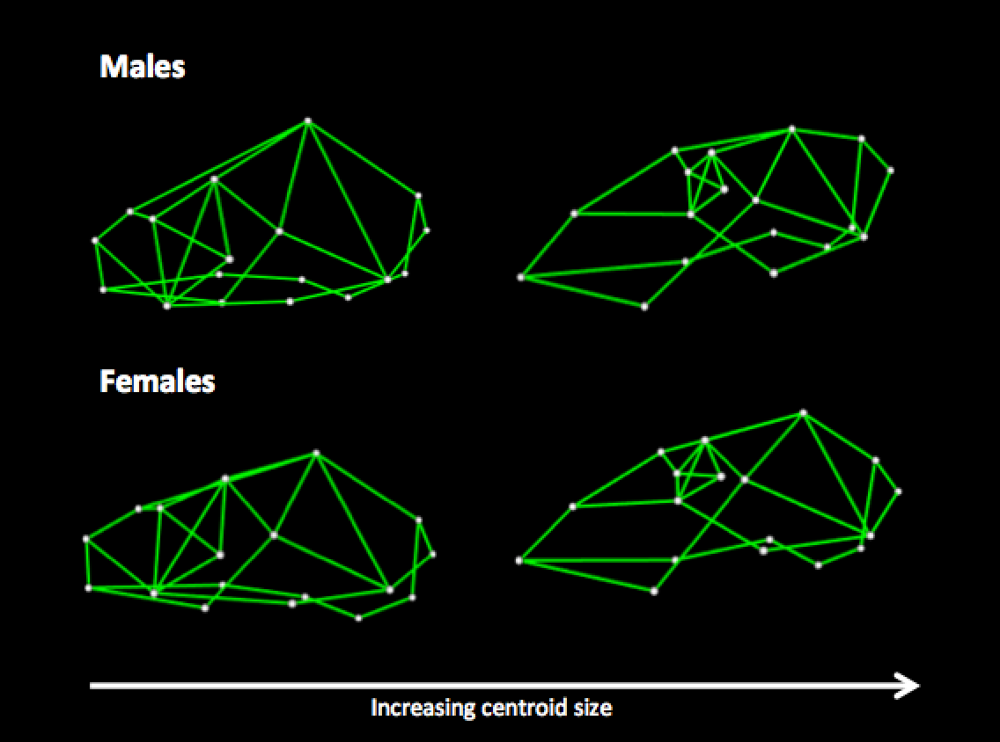

# Primate cranial shape evolution: Combining geometric morphometrics and phylogenetic comparative methods

[Randi H. Griffin]()

* The methods used in this project draw heavily upon the R package `geomorph` (Adams and Otarola-Castillo 2013).

___

## Introduction

The past few years have witnessed the development of many sophisticated statistical methods that combine geometric morphometrics with phylogenetic comparative methods. In addition, recently developed R packages have made these methods readily accessible to evolutionary biologists. These methods allow researchers to avoid spurious results due to failure to account for the phylogenetic structure of their data (Díaz-Uriarte and Garland 1996; Uyeda et al., 2015), and more excitingly, to test numerous macroevolutionary hypotheses that cannot be addressed with traditional geometric morphometrics or univarite phylogenetic comparative methods (Klingenberg and Marugan-Lobon 2013). 

This document summarizes the analyses and results I've obtained from applying phylogenetic geometric morphometric methods to a comparative dataset on primate cranial shape from Fleagle et al. (2010). By analyzing this data in a phylogenetic context, I hope to yield insights into the major ecological and evolutionary factors underlying broad patterns of variation in primate cranial shape. This investigation is divided into two parts:

1. Effects of allometry, ecology, and sexual dimorphism on primate cranial shape evolution
2. Modularity, integration, and rates of primate cranial shape evolution

The same landmark data and phylogeny are used in both parts. The primate cranial shape data includes 18 landmarks for a male and female specimen from a representative species from most primate genera. Since some species only had one of the sexes sampled, sample sizes were slightly different for males and females (*n* = 64 males, *n* = 61 females). Here is a figure depicting the landmarks, taken directly from Fleagle et al. (2010).

The phylogeny is a consensus tree from 10kTrees (Arnold et al. 2010). The only changes I made to the data involved editing taxa labels so that they match between the data and the phylogeny, and dropping two taxa from the landmark data because they were not present in the phylogeny. Landmarks were aligned using generalized procrustes alignment. Here is a view of the species and phylogeny:

Before investigating any predictors of primate cranial shape, it is important to determine whether there is a significant phylogenetic pattern in the data. I tested for significant phylogenetic signal using two methods. First, I used a multivariate extension of a well-known univariate measure of phylogenetic signal, Blomberg's K (Adams 2014). Second, I used an approach developed by Klingenberg and Gidaszewski (2010), which uses squared-change parsimony as a test statistic to compare the observed data to a null distribution obtained by permuting data at the tips of the tree. Both methods revealed strong phylogenetic signal in the data (*p* < 0.001), indicating that it is appropriate to analyze this data in a phylogenetic framework. We can visualize the phylogenetic structure of our shape data by projecting the phylogeny and ancestral state reconstructions into tangent space. 

This is similar to a traditional PCA plot, except in addition to plotting extant species in tangent space, this plot also projects squred-change parsimony ancestral states and depicts the phylogenetic relationships among data points. This figure shows the same patterns as the PCA plots in Fleagle et al. (2010), and provides a nice check that the data is correct. The first PCA largely separates strepsirrhines and haplorhines, while the second PCA largely separates platyrrhines and catarrhines. There appears to be greater interspecific morphological disparity among males than females. Several genera stand out as outliers, including *Homo*, *Alouatta*, *Varecia*, *Avahi*, and *Tarsius*. Several highly sexually dimorphic genera, *Gorilla*, *Pongo*, and *Mandrillus*, are outliers for males but cluster with Cercopithecoidea in females. One genus, *Saimiri* stands out among females, but not among males.

## PART 1: Effects of allometry, ecology, and sexual selection on primate cranial shape

Several major factors are expected to influence the evolution of primate cranial shape. Allometry is expected to affect the relative sizes, positions, and orientations of various parts of the skull (Ross 1995; Frost et al., 2003; Fleagle et al., 2010). Ecology is also expected to influence cranial shape by selecting for morphologies adapted to the activity pattern, diet, and locomotor habits of each species (Fleagle et al., 2010; Baab et al., 2014). Finally, sexual selection may be an important driver of morphological evolution, leading to sexual dimorphism in both cranial shape and size (Plavcan 2001). In this part of the study, I use multivariate phylogenetic regression to test for associations between cranial shape and size, ecology, and sexual selection.

### Allometry of cranial shape

In geometric morphometrics, allometry is most frequently characterized by regressing shape (a multidimensional array of 2D or 3D landmark coordinates) against size (typically measured as the log-transformed centroid sizes of the same shape data). Given a phylogeny and landmark data for the species at the tips, phylogenetic multivariate regression can be used to characterize evolutionary allometry. Using this approach, I find that centroid size explains 11% of variation in cranial shape for males and 7% for females. This is similar in magnitude to a recent study on the evolutionary allometry of cranial shape in birds, which found that centroid size explained 13% of variation in cranial shape across 160 bird species (Klingenberg and Marugán-Lobón 2013). The nature of the effect of allometry on shape can be assessed qualitatively by inspecting wireframe diagrams for predicted landmark coordinates for small and large species:

The wireframes support observations from previous research on the allometry of cranial shape in primates. The strongest patterns are that larger species tend to have relatively smaller orbits, longer snouts, and increased basicranial flexion. The relatively smaller orbits are expected due to negative allometry between eye size and cranial or body size (Ross 1995). In addition, this pattern may be exaggerated by the fact that most nocturnal primates are small-bodied while the largest primates are diurnal, and nocturnal primates have larger eyeballs than diurnal primates as an adaptation to low-light environments (Ross 1995). The elongated snout is also expected, as many studies in different groups of primates have found that jaw length shows positive allometry [why?] (e.g., Gould 1975; Hylander 1985; Singleton 2002; Taylor 2002). Finally, the positive allometry of basicranial flexion has been previously noted, and may be driven by increasing brain size in larger primates (Ross and Ravosa 1993).

### Ecomorphology of cranial shape

A major advantage of the broad taxonomic sampling in this dataset is that there is plenty of ecological variation, allowing us to test for associations between ecological traits and cranial shape. For instance, activity pattern and diet are likely to influence primate cranial shape through adaptations to the visual and masticatory systems, while the style of locomotion is expected to influence the morphology of the cranial base. I compiled categorical data on activity pattern, diet, and locomotion style for the species in this study using a variety of online resources: [IUCN](www.iucnredlist.org), [Primate Info Net](www.pin.primate.wisc.edu), and [Animal Diversity Web](www.animaldiversity.org).

For activity pattern, I coded species into two categories: 1 = diurnal/cathemeral and 2 = nocturnal. The major adaptation to nocturnal life expected to be reflected in our measures of cranial shape is relatively enlarged orbits to accomodate larger eyeballs.

For diet, I coded species into three categories meant to capture the degree to which the mascitory system should be adapted for mechanical advantage to facilitate powerful chewing: 1 = primarily frugivorous, 2 = mixture of frugivorous and folivorous/insectivorous, and 3 = primarily folivorous or insectivorous. This is an admittedly crude categorization that ignores much variation in diet, but statistical inference would be impossible with more complex categorization systems for such a data set of this size. 

For locomotion style, I coded species into two categories that capture the degree to which pronograde or orthograde postures are adopted during locomotion: 1 = primarily pronograde and 2 = primarily orthograde. Species exhibiting frequent orthograde locomotion fall into three major categories: vertical clinging and leaping, brachiation, and bipedalism. Although these are very different modes of locomotion, I assumed that the common feature of orthograde posture will have similar effects on the morphology of the cranial base, particularly in the relative location of the foramen magnum. 

Here is a figure depicting the ecology data:

I fit phylogenetic multivariate regression models for both males and females, including activity pattern, diet, locomotion style, and log-transformed centroid size as predictors. Results revealed that none of the ecological variables were significant predictors of cranial shape in either males or females, although activity pattern was close to significant in females (*p* = 0.055). Although this runs counter to our intuition based on a qualitative survey of primate crania and ecological categories, it does not necessarily count as strong evidence against the ecological hypotheses being tested. It could be that ecological variables drive evolutionary changes in cranial shape, but we do not have sufficient statistical power to detect these associations when phylogeny is controlled for. In support of this interpretation, associations between ecology and cranial shape are stronger when phylogeny is ignored: activity pattern becomes highly significant in both males and females (*p* < 0.001) and explains about 21-23% of variation in cranial shape, while locomotion style becomes significant in males (*p* < 0.05) and explains about 3% of variation in cranial shape. Diet remains non-significant for both males and females.  

A similar result was obtained by Baab et al. (2014), who found that controlling for phylogeny eliminated significant relationships between ecological variables and cranial shape in lemurs. I emphasize again that this does not imply that ecology does not influence the evolution of cranial shape. Cranial shape evolution has almost certainly been influenced by ecology, but we may lack statistical power to detect relationships if evolutionary shifts in ecology and morphology occur relatively scarcely across the phylogeny. Expanding the analysis to include non-primate mammals would be one way to increase statistical power to detect relationships between ecological categories and cranial shape, as this would add additional evolutionary transitions among ecological categories. Another way to increase statistical power, particularly for diet and locomotion, would be to use a continuous measurement that captures species tendencies more precisely than the crude categorical variables used here.

In addition to low statistical power, the lack of strong support for a relationship between diet or locomotion and cranial shape could also reflect inadequacies in the coding scheme adopted or inadequacies in the landmarks included in the study. Activity pattern is more straightforward on both counts, as it is relatively clear cut whether a species is nocturnal or not, and the major cranial adapation for nocturnal life is large orbits, which the landmarks in this study capture well. On the other hand, diet and locomotion style are more varied and less discrete than activity pattern, and the morphological adaptations expected for diet and locomotion style may not be captured as easily by the landmarks in this study. Dietary adaptations are largely reflected in tooth and mandible morphology, both of which are absent in the landmark data. On the other hand, adaptations for different locomotion styles may be largely reflected in the morphology of the cranial base, which is difficult to characterize with intact specimens (Fleagle et al., 2010). 

### Sexual selection and cranial shape

In species where individuals engage in agonistic competition for mates, sexual selection may influence the evolution cranial shape in a number of ways (Plavcan 2001). Frequent agonistic interactions will select for traits that aid individuals in fighting or frightening others. For example, there is strong evidence that body mass and canine size are associated with agonistic mate competition across species, and both of these traits will influence cranial shape (e.g., through allometric effects and selection for larger gape to accomodate large canines). Of course, if one sex (typically males) experiences agonistic competition more strongly than the other sex (typically females), this may select for sexual dimorphism in cranial traits associated with agonism. In addition to influencing the *direction* of selection, sexual selection may also influence *rates* of cranial shape evolution if cranial traits are influenced directly or indirectly by the targets of sexual selection. This suggestion is supported by the phylomorphospace plots in the introduction, which hint that the largest changes in cranial shape occur along lineages with high sexual dimorphism.  

In this section, I test the hypothesis that cranial shape evolution is influenced by sexual selection. I focus on sexual selection due to agonistic competition for mates, because although sexual selection can occur without agonistic competition (e.g., sperm competition, female choice, etc), these mechanisms are less likely to influence the direction or rate of evolution in cranial traits. I run analyses for both male and female crania with the expectation that the influence of agonistic competition will be stronger for males, although it is possible that an effect will also be present for females, either because of pleiotropy or because agonistic competition is prevalent in both sexes of some species. To measure the strength of sexual selection due to agonistic competition, I obtained estimates of male and female body mass from Smith and Jungers (1994), and quantified sexual dimorphism in body mass as ln(male body mass) - ln(female body mass). [maybe it's also worth obtaining categorical classifications of agonism levels from previous studies, since that is a more direct measure of agonism]. I predict that if sexual selection due to agonistic competition influences cranial shape evolution, then the degree of sexual dimorphism in body mass will be significantly associated with the direction of cranial shape evolution and patterns of cranial shape divergence, with stronger effects in males than in females. 

I use phylogenetic multivariate regression to test the prediction that the degree of sexual dimorphism influences the direction of cranial shape evolution across primates. It is well known that body mass and sexual dimorphism are correlated in anthropoid primates, thus I include log transformed centroid size in the model to control for allometric effects. When predictor variables in a regression are correlated, this raises the potential for problematic multicollinearity, which can lead to unreliable parameter estimates. I quantified the severity of multicollinearity between sexual dimorphism and log transformed centroid size with variance inflation factors (VIF) based on PGLS regression, and found that while the two measures were significantly correlated in both males (*slope* = 0.41; *R^2* = 0.27; *p* < 0.001) and females (*slope* = 0.34; ; *R^2* = 0.13; *p* < 0.01), VIFs were only 1.37 for males and 1.15 for females, indicating that it is not problematic to include these variables together as predictors in the regression model. [the most conservative rules of thumb say that VIF > 2 is a cause for concern]

Results revealed that sexual dimorphism was a significant predictor of cranial shape in both males (*p* < 0.001) and females (*p* < 0.01). In support of our predictions, sexual dimorphism explained nearly twice as much variation in cranial shape in males verses females (20% versus 11%). Log centroid size was nearly significant for males (*p* = 0.057) and significant for females (*p* < 0.05), although it explained a small proportion of variation in cranial shape (2.4% in males and 3.1% in females). This suggests that much of the variation attributed to allometric effects in the initial analysis on the evolutionary allometry of cranial shape may be due to sexually dimorphic aspects of cranial shape in larger species. Wireframe diagrams reveal the nature of the influence of sexual dimorphism on cranial shape evolution:

**[Need to figure out how to extract predicted values from model]**

To investigate the effects of agonistic competition on patterns of cranial shape divergence, I use an approach based on phylogenetically independent contrasts (PIC; Felsenstein 1985). The PIC algorithm computes *n* - 1 statistically independent contrasts and ancestral states for each internal node of a phylogenetic tree. Each independent contrast is a branch-length standardized measure of the amount of evolutionary change that has occurred along the branches leading from a node to two sister taxa, and each ancestral state is a branch-length standardized average of the trait values of the descendent sister taxa. To assess whether levels of agonistic competition are associated with cranial shape divergence, I follow three steps. First, I compute independent contrasts for cranial landmarks and take the sum of the absolute values of all the contrasts at each node as a measure of the evolutionary divergence in cranial shape between the descendants of that node. Second, I use the PIC algorithm to estimate phylogenetically independent ancetral states for sexual dimorphism at each node. Finally, I regress the estimates of shape divergence against the estimates of sexual dimorphism, including independent contrasts of log centroid size in the regression model to control for allometry. Note that this approach cannot distinguish between stasis and convergent evolution, thus large contrasts at a node indicate that the two descendents of that node have undergone a large divergence in morphospace, while small contrasts could indicate either stasis or convergent evolution along both lineages.

Results indicate that sexual dimorphism in body mass is positively associated with evolutionary divergence in cranial shape in both males (*R^2* = 0.15; *p* < 0.001) and females (*R^2* = 0.08; *p* < 0.05), while log centroid size is non-significant (*p* > 0.05). The relationship between evolutionary divergence in cranial shape and sexual dimorphism can be visualized with scatterplots (note that cranial shape divergence is on a log scale): 

By plotting separate data points for strepsirrhines and haplorhines, it becomes apparent that this result is driven by patterns of variation among haplorhine primates, since strepsirrhines show little variation in sexual dimorphism. To gain a more nuanced view of where the largest changes in cranial shape may have occurred across the primate phylogeny, we can visualize the primate phylogeny with the size of each node label proportional to the divergence in cranial shape between its immediate descendants, as estimated by independent contrasts. 

The largest divergences in cranial shape appear to have occurred among the most sexually dimorphic genera in the apes and papionins. 

It is interesting to consider the results of these analyses jointly. On one hand, the fact that the direction of cranial shape evolution is significantly predicted by sexual dimorphism indicates that there is a common direction in morphospace towards which sexually dimorphic species tend to evolve. As a consequence, we should expect that as species evolve sexual dimorphism (presumably due to agonistic competition for mates), they will converge on a similar cranial shape. On the other hand, the analysis of cranial shape divergence show that lineages descending from highly sexually dimorphic ancestors tend to exhibit high levels of divergence in cranial shape. Taken together, these results are consistent with a model of evolution in which sexual selection due to agonistic competition for mates simultaneously leads to convergence for some aspects of cranial shape and heightened rates of divergence for other aspects of cranial shape. 

## PART 2: Modularity, integration, and rates of primate cranial shape evolution

Modularity and integration are closely related concepts that describe patterns of covariation among anatomical structures within organisms. Modular structures are relatively independent of one another, while integrated structures tend to covary. Modularity and integration can be observed at multiple levels: across ontogenetic stages within an individual, across individuals within a population or species, and across species within a higher taxonomic group. In addition, multiple biological processes contribute to patterns of integration at each level of variation, including genetic pleiotropy, linkage disequilibrium, allometry, physical interactions among structures during development, and environmental factors that simultaneously influence the development or evolution of multiple structures. Detecting patterns of modularity and integration and the processes that give rise to them requires different study designs depending on the level of variation and the biological process under investigation.

The vast majority of research on cranial modularity and integration has focused on variation within populations or species (Klingenberg 2013). However, modularity and integration can also be studied on a macroevolutionary scale (Klingenberg & Marugán-Lobón 2013). At this scale, patterns of modularity and integration are influenced by a combination of genetic, developmental, functional, and evolutionary factors. Previous studies have found that overall patterns of cranial modularity are remarkably consistent across primates (bunch of studies, cited in Ackerman 2009) and even across mammals (Goswami 2006; Marroig et al., 2009; Porto et al., 2009). This stability is likely due in part to genetic and developmental constraints, and in part due to stabilizing selection. On the other hand, while *patterns* of modularity are largely stable across taxa, the *magnitude* of integration across modules can vary considerably (e.g., Claverie & Patek, 2013), and it has been hypothesized that variation in the strength of integration can influence morphological evolution on a macroevolutionary scale (Olson & Miller, 1958). For instance, it has been hypothesized that modularity will tend to increase through evolutionary time as natural selection favors the relaxation of constraints that integration places on morphological diversification (Marcot & McShea, 2007; Porto et al., 2009). Another hypothesis is that greater modularity facilitates higher rates of evolutionary change because different modules can respond independently to different selection pressures, while greater integration results in slower evolutionary rates (Goswami & Polly, 2010; Claverie & Patek, 2013; Goswami et al., 2015). 

[COMING SOON!]

## Conclusions

This project demonstrates the broad scope of macroevolutionary questions that can be addressed when geometric morphometrics and phylogenetic comparative methods are integrated. 

## References

- Adams DC. 2014. A generalized K statistic for estimating phylogenetic signal from shape and other high-dimensional multivariate data. Syst Biol 63:685-697.

- Adams DC, Otarola-Castillo E. 2013. geomorph: an R package for the collection and analysis of geometric morphometric shape data. Meth Ecol Evol 4:393-399.

- Arnold C, Matthews LJ, Nunn CL. 2010. The 10kTrees Website: a new online resource for primate phylogeny, v3. Evol Anthropol 19: 114–118.

- Baab KL, Perry JMG, Rohlf FJ, Jungers WL. 2014. Phylogenetic, ecological, and allometric correlates of cranial shape in Malagasy lemurs. Evolution 68(5):1450-1468.

- Díaz-Uriarte R, Garland T. 1996. Testing hypotheses of correlated evolution using phylogenetically independent contrasts: sensitivity to deviations from Brownian Motion. Syst Biol 45(1):27-47.

- Fleagle JG, Gilbert CC, Baden AL. 2010. Primate cranial diversity. Am J Phys Anth 142:565-578.

- Frost SR, Marcus LF, Bookstein FL, Reddy DP, Delson E. 2003. Cranial allometry, phylogeography, and systematics of large-bodied papionins (primates: Cercopithecinae) inferred from geometric morphometric analysis of landmark data. Anat Rec Part A: Disc Mol Cel Evo Biol 275A(2):1048-1072.

- Gould SJ. 1975. On the scaling of tooth size in mammals. Am Zool 15(2):353-362.

- Harrison PW, Wright AE, Zimmer F, Dean R, Montgomery SH, Pointer MA, Mank JE. 2015. Sexual selection drives evolution and rapid turnover of male gene expression. PNAS 112(14):4393-4398.

- Hylander WL. 1985. Mandibular function and biomechanical stress and scaling. Amer Zool 25(2):315-330.

- Klingenberg CP, Gidaszewski NA. 2010. Testing and quantifying phylogenetic signals and homoplasy in morphometric data. Syst Biol 59:245-261.

- Klingenberg CP, Marugan-Lobon J. 2013. Evolutionary covariation in geometric morphometric data: analyzing integration, modularity, and allometry in a phylogenetic context. Syst Biol 62(4):591-610.

- Plavcan JM. 2001. Sexual dimorphism in primate evolution. Yearbook Phys Anthro 44:25-53.

- Ross CF. 1995. Allometric and functional influences on primate orbit orientation and the origins of the Anthropoidea. J Hum Evol 29(3):201-227.

- Ross CF, Ravosa MJ. 1993. Basicranial flexion, relative brain size, and facial kyphosis in nonhuman primates. Am J Phys Anthro 91:305-324.

- Singleton M. 2002. Patterns of cranial shape variation in the Papionini (Primates: Cercopithecinae). J Hum Evo 42:547-578.

- Smith RJ, Jungers WL. 1997. Body mass in comparative primatology. J Hum Evol 32(6):523-559.

- Taylor AB. 2002. Masticatory form and function in the African apes. Am J Phys Anthro 117:133-156.

- Uyeda JC, Caetano DS, Pennell MW. 2015. Comparative analyses of principal components can be misleading. Syst Biol 64(4):677-89.

___